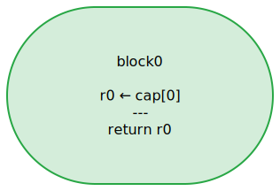
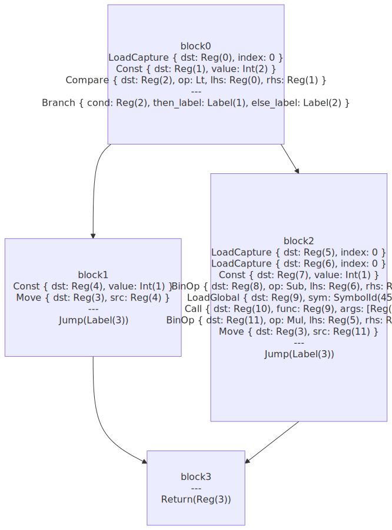
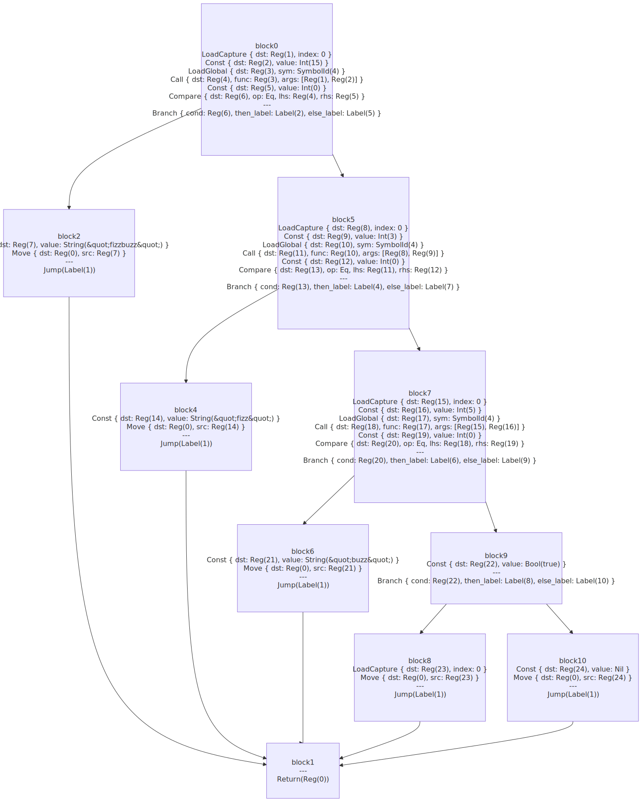
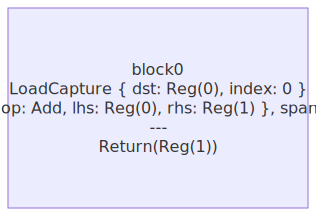
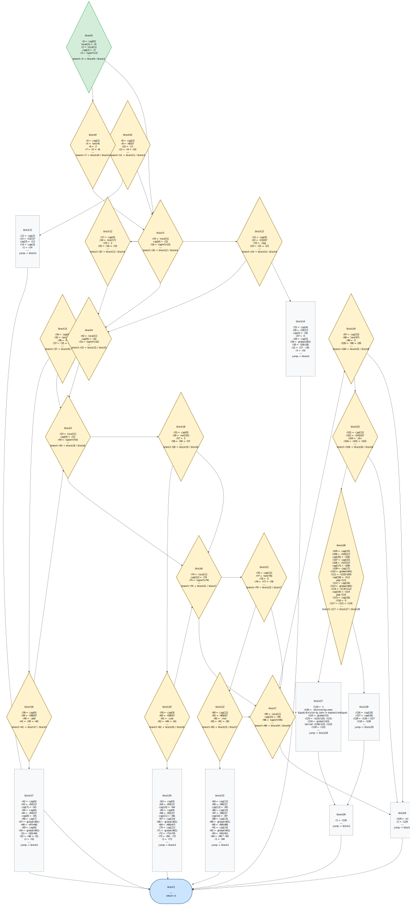

# CFG Visualizer

Renders control flow graphs of Elle functions to SVG files.

Uses `fn/cfg` to produce Mermaid flowchart text from a closure's LIR,
then the selkie plugin to render Mermaid to SVG.

## Prerequisites

Build the selkie plugin:

```bash
cargo build --release -p elle-selkie
```

## Running

```bash
cargo run --release -- demos/cfgviz/cfgviz.lisp
```

## Output

### identity

`(defn identity [x] x)` — single block, no branching.



### factorial

Recursive factorial — branch + self-call.



### fizzbuzz

Nested `cond` — multiple branch paths.



### make-adder

Returns a closure — shows captured variable handling.



### eval-expr

6-way `match` expression evaluator — match dispatch, recursion, `let*` binding, conditional error. Many blocks with cross-edges.


